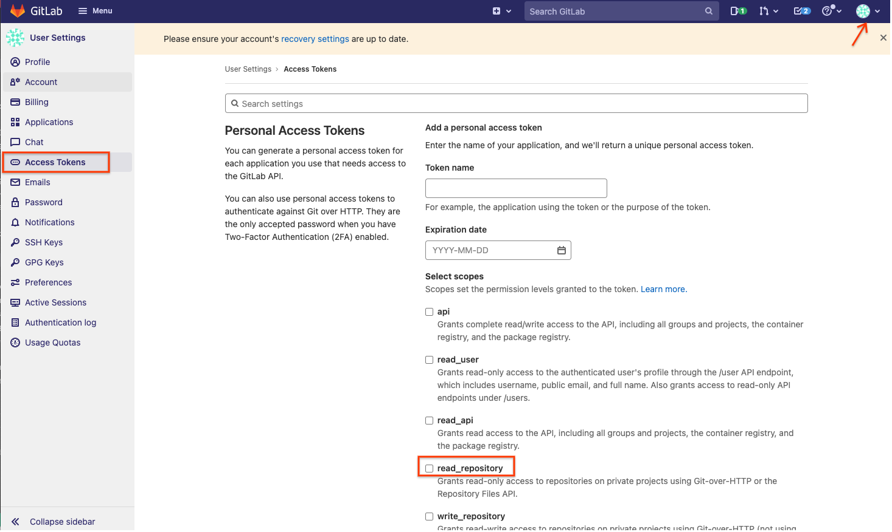

# Overview

This is a group of Ansible playbooks and bash scripts that are used to provision and manage Anthos bare metal given a physical or cloud inventory.

There are two deployment types: Physical and Cloud. Both deployment types can co-exist. Communication between any of the ABM instances are supported over the LAN supporting the hardware or cloud instances. Networking is not configured to communicate cross network boundaries (nothing prevents this being built, just not in the scope of this project)

> **Physical** - Scripts and Playbooks designed to deploy onto physical servers meeting requirements.
* In this project, all physical machines will have "nuc" as a prefix for hostname and varaible names.

> **Cloud** - Scripts and Playbooks designed to be deployed into GCE Virtual Machines.
* In this project, all cloud machines will have "cnuc" as a prefix for hostname and varaible names.

## Terms to know

> **Target machine(s)** - The machine that the cluster is being installed into/onto (ie, NUC, GCE, etc). This is often called the "host" in public documentation.

> **Provisioning machine** - The machine that initiates the `ansible` run. This is typically a laptop or the cloud shell within the GCP console

## Provisioning Solution

The following steps are broken into one-time and repeatable steps used to provision the ***target machine(s)***. Most of the steps are common scross both Physical and Cloud deployment options, but will note when a specific step is needed for either.

### Starting Steps
1. Fork or clone this repository
2. [Add a token](https://docs.gitlab.com/ee/user/project/deploy_tokens/) to the Git repo with **read_repository** privilege. Remember the token name that will be used for env var **SCM_TOKEN_USER**. Copy the token string that will be uesd for env var **SCM_TOKEN_TOKEN**. Go to user **Preferences** on the top right corner.
   
3. Review and complete the [one-time setup](docs/ONE_TIME_SETUP.md) steps
    1. Result should be baseline provisioned inventory resources (ie, GCE instances and/or physical machines with passwordless SSH access)
4. Provision inventory using Playbooks

## Installing Anthos Bare Metal

The Ansible script installs Ansible Bare Metal on all of the inventory hosts and on any Cloud GCE instance created with the `scripts/create-cloud-gce-baseline.sh` script

### Environment Variables

It is recommended to use [direnv](https://direnv.net/) to manage local environment variables. Storing each of the below variables in a `.envrc` file.

| Environment Variable | Required | Description | Default Value |
|:---------------------|:--------:|:------------|:-------------:|
| LOCAL_GSA_FILE       |  Y       |  Google Service Account key to a GSA that is used to provision and activate all Google-based services (all `gcloud` commands) from inside the Target machine(s) | N/A |
| PROJECT_ID           |  N       |  Google Project ID to put clusters, Service Accounts and API services into | gcloud config |
| SSH_PUB_KEY_LOCATION |  N       |  SSH public key location for Ansible | `$HOME/.ssh/cnucs-cloud.pub` |
| ZONE                 |  N       |  Google default zone | gcloud config  |
| SCM_TOKEN_USER       |  Y       |  Git repo token user/name | none  |
| SCM_TOKEN_TOKEN      |  Y       |  Git repo token string | none  |

Most scripts use the project ID set in gcloud config. The create-cloud-gce-baseline.sh can also take the project ID on the command line or as an environment variable.
Region defaults to the gcloud config region.

GSA Permissions should include:
- Editor (roles/editor) or Owner (roles/owner)
- Storage Object Viewer (roles/storage.objectViewer)
- Project IAM Admin (roles/resourcemanager.projectIamAdmin)
- Secret Manager Admin (roles/secretmanager.admin)
- Secret Manager Secret Accessor (secretmanager.secretAccessor)

NOTE: This is not necessarily the minimal-roles, further work will refine this). Please use `scripts/create-primary-gsa.sh` to generate the GSA and key if unfamilar on how to do this.

### Running Ansible Install

This is intended to be used for the initial installation. Upgrades are not included in the `site.yml` playbook

```bash
ansible-playbook -K -i inventory/ site.yml
```

## Playbooks

### Update/Upgrade OS

Equivalent of `apt-get update && apt-get upgrade` and `gcloud components update` (both without requiring human input)

```bash
# Update all servers ()
ansible-playbook -K -i inventory/ update-servers.yml
```

## Configurations

### Environment IPs

The below are IPs used in the installation process. The configuration for these exists in the `inventory/host_vars/<host>.yaml` files.

* control_plane_vip -- IP address that is addressable & available, not overlapping with other clusters, but not pre-allocated. This is created during the process
* ingress_vip -- Must be in the Load Balancer pool for the cluster, same rules as control_plane_vip for availability
* load_balancer_pool_cidr -- IP addresses for the LoadBalancers (bundled mode) can attach to, same rules as control_plane_vip
* control_plane_ip -- different than the `control_plane_vip`, this is the IP of the box you are installing on

> NOTE: The default inventory file sets up 9 LBs allocated per cluster, with 1 taken for Ingress (sufficient for POC and basic work)

## Little helpers

1. Remove ACM. NOTE: This hangs because the K8s API hangs due to namespace existing in listing but not existing in cluster. Cancel after about 30 seconds (ctrl+c) and re-run to verify gone. (not going to provide the 'dump-to-file, patch, run patch' fix here)

```bash
ansible workers -i inventory.yml --become -m shell -a "export KUBECONFIG=/var/kubeconfig/kubeconfig && kubectl delete -f /var/acm-configs/config-management-operator.yaml" -K
```

1. Create `git-creds` for the namespaces (FUTURE: this will be handled with `ExternalSecrets` and Secrets Manager)

```bash
    kubectl create secret generic git-creds --from-literal=username=${SCM_TOKEN_USER} --from-literal=token=${SCM_TOKEN_TOKEN} --namspace="xyz" # xyz = namespace
```
